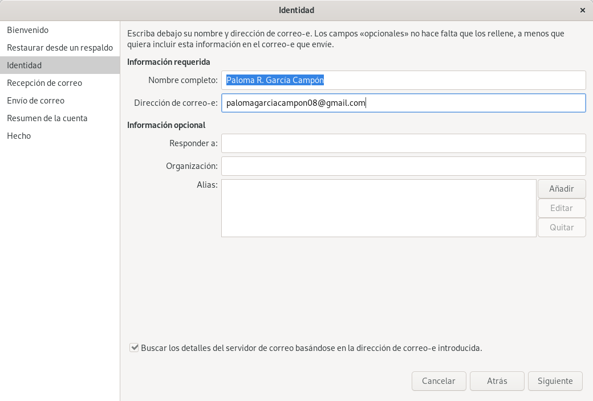
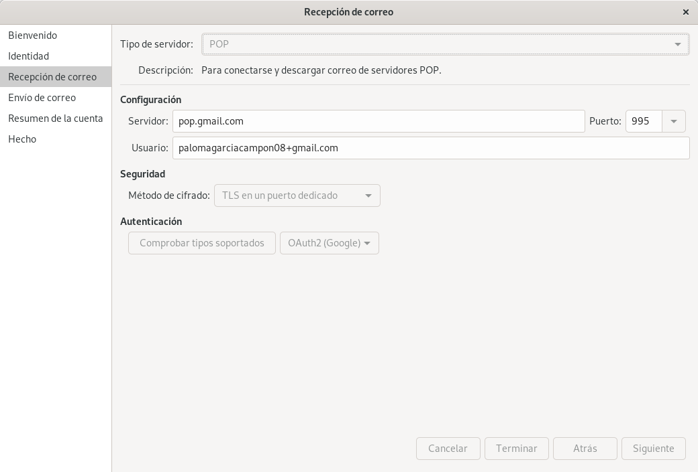
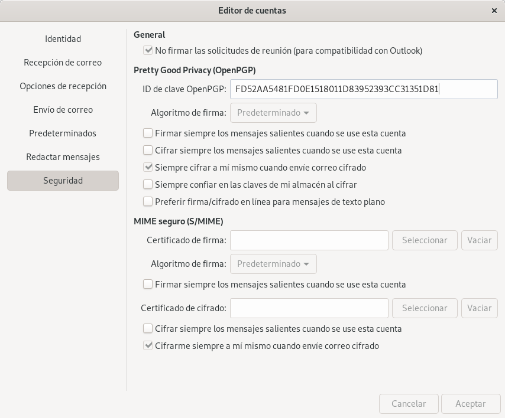
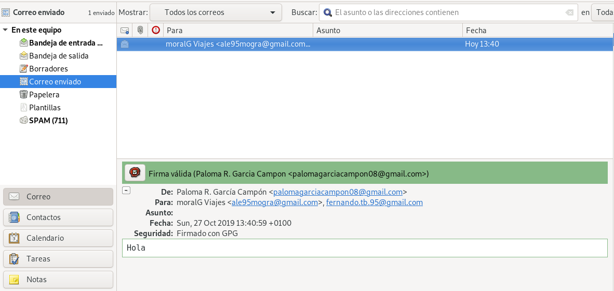
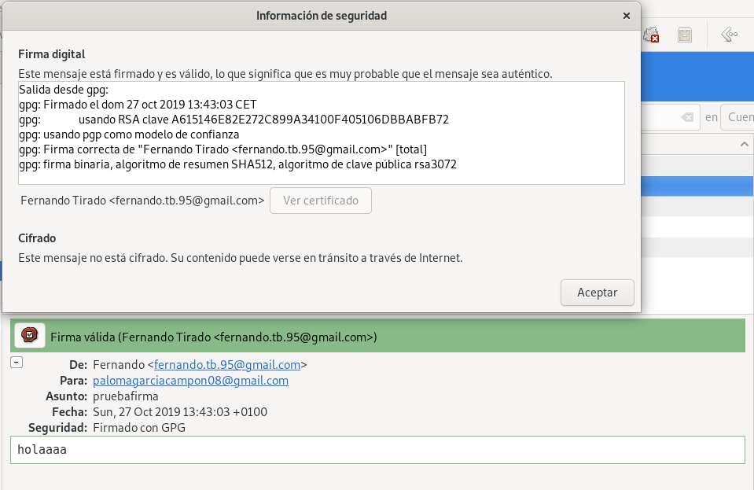

# Práctica: Integridad, firmas y autenticación
## Tarea 1: Firmas electrónicas 
>En este primer apartado vamos a trabajar con las firmas electrónicas, para ello te pueden ayudar los siguientes enlaces:

*GPG*

#### 1. Manda un documento y la firma electrónica del mismo a un compañero. Verifica la firma que tu has recibido.
Para crear la firma electrónica de un documento:
~~~
paloma@coatlicue:~$ gpg --output pruebaFirma.txt.sig --detach-sign pruebaFirma.txt 
~~~

Verificamos el fichero que hemos recibido:
~~~
paloma@coatlicue:~$ gpg --verify pruebaFirma_alejandro.txt.sig 
gpg: asumiendo que los datos firmados están en 'pruebaFirma_alejandro.txt'
gpg: Firmado el mar 15 oct 2019 12:28:43 CEST
gpg:                usando RSA clave EC7EEAB6F3986FD97F72A4409F229BC929C410C4
gpg: Firma correcta de "Alejandro Morales Gracia <ale95mogra@gmail.com>" [desconocido]
gpg: ATENCIÓN: ¡Esta clave no está certificada por una firma de confianza!
gpg:          No hay indicios de que la firma pertenezca al propietario.
Huellas dactilares de la clave primaria: EC7E EAB6 F398 6FD9 7F72  A440 9F22 9BC9 29C4 10C4
~~~

#### 2. ¿Qué significa el mensaje que aparece en el momento de verificar la firma?
~~~
gpg: Firma correcta de "Pepe D <josedom24@gmail.com>" [desconocido]
gpg: ATENCIÓN: ¡Esta clave no está certificada por una firma de confianza!
gpg:          No hay indicios de que la firma pertenezca al propietario.
Huellas dactilares de la clave primaria: E8DD 5DA9 3B88 F08A DA1D  26BF 5141 3DDB 0C99 55FC
~~~

Significa que, aunque el fichero y el certificado concuerdan, no hay ninguna garantía de que el usuario de la firma sea de verdad esa persona.

#### 3. Vamos a crear un anillo de confianza entre los miembros de nuestra clase, para ello.
- Tu clave pública debe estar en un servidor de claves

- Puedes seguir el esquema que se nos presenta en la siguiente página de Debian:

- Una vez que firmes una clave se la tendrás que devolver a su dueño, para que otra persona se la firme.

- Cuando tengas las tres firmas sube la clave al servidor de claves y rellena tus datos en la tabla Claves públicas PGP 2019-2020

- Asegurate que te vuelves a bajar las claves públicas de tus compañeros que tengan las tres firmas.

~~~
gpg --keyserver pgp.rediris.es --send-key FD52AA5481FD0E1518011D83952393CC31351D81
~~~

- Escribe tu fingerprint en un papel y dárselo a tu compañero, para que puede descargarse tu clave pública.
Para encontrar mi fingerprint:
~~~
paloma@coatlicue:~$ gpg --edit-key palomagarciacampon08@gmail.com
gpg (GnuPG) 2.2.12; Copyright (C) 2018 Free Software Foundation, Inc.
This is free software: you are free to change and redistribute it.
There is NO WARRANTY, to the extent permitted by law.

Clave secreta disponible.

sec  rsa3072/952393CC31351D81
     creado: 2019-10-07  caduca: 2019-11-06  uso: SC  
     confianza: absoluta      validez: absoluta
ssb  rsa3072/D7F9FDBB7151CA51
     creado: 2019-10-07  caduca: 2019-11-06  uso: E   
[  absoluta ] (1). Paloma R. Garcia Campon <palomagarciacampon08@gmail.com>

gpg> fpr
pub   rsa3072/952393CC31351D81 2019-10-07 Paloma R. Garcia Campon <palomagarciacampon08@gmail.com>
 Huella clave primaria: FD52 AA54 81FD 0E15 1801  1D83 9523 93CC 3135 1D81
~~~

- Te debes bajar al menos tres claves públicas de compañeros. Firma estas claves.

Se descarga la clave:
~~~
paloma@coatlicue:~$ gpg --keyserver pgp.rediris.es --search-key A615 146E 82E2 72C8 99A3  4100 F405 106D BBAB FB72
gpg: data source: http://130.206.1.8:11371
(1)	Fernando Tirado <fernando.tb.95@gmail.com>
	  3072 bit RSA key F405106DBBABFB72, creado: 2019-10-07, caduca: 2019-11-06
Keys 1-1 of 1 for "A615 146E 82E2 72C8 99A3 4100 F405 106D BBAB FB72".  Introduzca número(s), O)tro, o F)in > 1
gpg: clave F405106DBBABFB72: "Fernando Tirado <fernando.tb.95@gmail.com>" sin cambios
gpg: Cantidad total procesada: 1
gpg:              sin cambios: 1
~~~

Se firma:
~~~
paloma@coatlicue:~$ gpg --sign-key A615146E82E272C899A34100F405106DBBABFB72

pub  rsa3072/F405106DBBABFB72
     creado: 2019-10-07  caduca: 2019-11-06  uso: SC  
     confianza: desconocido   validez: desconocido
sub  rsa3072/1A3DEC0EAA18E3ED
     creado: 2019-10-07  caduca: 2019-11-06  uso: E   
[desconocida] (1). Fernando Tirado <fernando.tb.95@gmail.com>

pub  rsa3072/F405106DBBABFB72
     creado: 2019-10-07  caduca: 2019-11-06  uso: SC  
     confianza: desconocido   validez: desconocido
 Huella clave primaria: A615 146E 82E2 72C8 99A3  4100 F405 106D BBAB FB72

     Fernando Tirado <fernando.tb.95@gmail.com>

Esta clave expirará el 2019-11-06.
¿Está realmente seguro de querer firmar esta clave
con su clave: "Paloma R. Garcia Campon <palomagarciacampon08@gmail.com>" (952393CC31351D81)?

¿Firmar de verdad? (s/N) s

paloma@coatlicue:~$ gpg --output Ftirado.asc --export A615146E82E272C899A34100F405106DBBABFB72
El fichero 'Ftirado.asc' ya existe. ¿Sobreescribir? (s/N) s
~~~

Se repite el procedimiento con otros dos compañeros:
~~~
paloma@coatlicue:~$ gpg --keyserver pgp.rediris.es --search-key EC7E EAB6 F398 6FD9 7F72  A440 9F22 9BC9 29C4 10C4
gpg: data source: http://130.206.1.8:11371
(1)	Alejandro Morales Gracia <ale95mogra@gmail.com>
	  3072 bit RSA key 9F229BC929C410C4, creado: 2019-10-14, caduca: 2021-10-13
Keys 1-1 of 1 for "EC7E EAB6 F398 6FD9 7F72 A440 9F22 9BC9 29C4 10C4".  Introduzca número(s), O)tro, o F)in > 1
gpg: clave 9F229BC929C410C4: "Alejandro Morales Gracia <ale95mogra@gmail.com>" sin cambios
gpg: Cantidad total procesada: 1
gpg:              sin cambios: 1

paloma@coatlicue:~$ gpg --sign-key EC7EEAB6F3986FD97F72A4409F229BC929C410C4
paloma@coatlicue:~$ gpg --output MoralGFirmada.asc --export EC7EEAB6F3986FD97F72A4409F229BC929C410C4
paloma@coatlicue:~$ scp MoralGFirmada.asc moralg@172.22.9.198:
~~~

~~~
paloma@coatlicue:~$ gpg --sign-key C7BAE0D4F7D76C1AFB523DB11ED42C7688EC344D
paloma@coatlicue:~$ gpg --output firmaPaloma.asc --export C7BAE0D4F7D76C1AFB523DB11ED42C7688EC344D
~~~

- Tu te debes asegurar que tu clave pública es firmada por al menos tres compañeros de la clase.
Añado la firma que me han enviado:
~~~
paloma@coatlicue:~$ gpg --import Palomatomatufirma.asc 
gpg: clave 952393CC31351D81: "Paloma R. Garcia Campon <palomagarciacampon08@gmail.com>" 1 firma nueva
gpg: Cantidad total procesada: 1
gpg:         nuevas firmas: 1
gpg: marginals needed: 3  completes needed: 1  trust model: pgp
gpg: nivel: 0  validez:   1  firmada:   1  confianza: 0-, 0q, 0n, 0m, 0f, 1u
gpg: nivel: 1  validez:   1  firmada:   0  confianza: 1-, 0q, 0n, 0m, 0f, 0u
gpg: siguiente comprobación de base de datos de confianza el: 2019-11-06
~~~

~~~
paloma@coatlicue:~$ gpg --import ClavePalomaFirmada.asc 
gpg: clave 952393CC31351D81: "Paloma R. Garcia Campon <palomagarciacampon08@gmail.com>" 1 firma nueva
gpg: Cantidad total procesada: 1
gpg:         nuevas firmas: 1
gpg: marginals needed: 3  completes needed: 1  trust model: pgp
gpg: nivel: 0  validez:   1  firmada:   2  confianza: 0-, 0q, 0n, 0m, 0f, 1u
gpg: nivel: 1  validez:   2  firmada:   0  confianza: 2-, 0q, 0n, 0m, 0f, 0u
gpg: siguiente comprobación de base de datos de confianza el: 2019-11-06
~~~

~~~
paloma@coatlicue:~$ gpg --import Descargas/clavePaloma.asc 
~~~

#### 4. Muestra las firmas que tiene tu clave pública.
~~~
paloma@coatlicue:~$ gpg --list-sign
/home/paloma/.gnupg/pubring.kbx
-------------------------------
pub   rsa3072 2019-10-07 [SC] [caduca: 2019-11-06]
      FD52AA5481FD0E1518011D83952393CC31351D81
uid        [  absoluta ] Paloma R. Garcia Campon <palomagarciacampon08@gmail.com>
sig 3        952393CC31351D81 2019-10-07  Paloma R. Garcia Campon <palomagarciacampon08@gmail.com>
sig          F405106DBBABFB72 2019-10-22  Fernando Tirado <fernando.tb.95@gmail.com>
sig          9F229BC929C410C4 2019-10-22  Alejandro Morales Gracia <ale95mogra@gmail.com>
sig          1ED42C7688EC344D 2019-10-22  Juan Antonio Reifs Ramirez <initiategnat9@gmail.com>
sub   rsa3072 2019-10-07 [E] [caduca: 2019-11-06]
sig          952393CC31351D81 2019-10-07  Paloma R. Garcia Campon <palomagarciacampon08@gmail.com>
~~~

#### 5. Comprueba que ya puedes verificar sin “problemas” una firma recibida por una persona en la que confías.

Se añade la clave del compañero actualizada:
~~~
paloma@coatlicue:~$ gpg --import ClaveAlejadroActualizada.asc 
gpg: clave 9F229BC929C410C4: "Alejandro Morales Gracia <ale95mogra@gmail.com>" 2 firmas nuevas
gpg: Cantidad total procesada: 1
gpg:         nuevas firmas: 2
gpg: marginals needed: 3  completes needed: 1  trust model: pgp
gpg: nivel: 0  validez:   1  firmada:   3  confianza: 0-, 0q, 0n, 0m, 0f, 1u
gpg: nivel: 1  validez:   3  firmada:   0  confianza: 3-, 0q, 0n, 0m, 0f, 0u
gpg: siguiente comprobación de base de datos de confianza el: 2019-11-06
~~~

Y se verifica:
~~~
paloma@coatlicue:~$ gpg --verify paraPaloma.txt.sig 
gpg: asumiendo que los datos firmados están en 'paraPaloma.txt'
gpg: Firmado el mar 22 oct 2019 12:51:33 CEST
gpg:                usando RSA clave EC7EEAB6F3986FD97F72A4409F229BC929C410C4
gpg: Firma correcta de "Alejandro Morales Gracia <ale95mogra@gmail.com>" [total]
~~~

#### 6. Comprueba que puedes verificar sin “problemas” una firma recibida por una tercera persona en la que confía una persona en la que tu confías.

Hay que editar la clave del compañero en el que vamos a confiar para tener confianza absoluta:
~~~
paloma@coatlicue:~/DISCO2/CICLO II/SEGURIDAD/2. Criptografía/Integridad-firmas-y-autenticaci-n-$ gpg --edit-key A615146E82E272C899A34100F405106DBBABFB72
gpg (GnuPG) 2.2.12; Copyright (C) 2018 Free Software Foundation, Inc.
This is free software: you are free to change and redistribute it.
There is NO WARRANTY, to the extent permitted by law.

pub  rsa3072/F405106DBBABFB72
     creado: 2019-10-07  caduca: 2019-11-06  uso: SC  
     confianza: desconocido   validez: total
sub  rsa3072/1A3DEC0EAA18E3ED
     creado: 2019-10-07  caduca: 2019-11-06  uso: E   
[   total   ] (1). Fernando Tirado <fernando.tb.95@gmail.com>

gpg> trust
pub  rsa3072/F405106DBBABFB72
     creado: 2019-10-07  caduca: 2019-11-06  uso: SC  
     confianza: desconocido   validez: total
sub  rsa3072/1A3DEC0EAA18E3ED
     creado: 2019-10-07  caduca: 2019-11-06  uso: E   
[   total   ] (1). Fernando Tirado <fernando.tb.95@gmail.com>

Por favor, decida su nivel de confianza en que este usuario
verifique correctamente las claves de otros usuarios (mirando
pasaportes, comprobando huellas dactilares en diferentes fuentes...)

  1 = No lo sé o prefiero no decirlo
  2 = NO tengo confianza
  3 = Confío un poco
  4 = Confío totalmente
  5 = confío absolutamente
  m = volver al menú principal

¿Su decisión? 5
¿De verdad quiere asignar absoluta confianza a esta clave? (s/N) s

pub  rsa3072/F405106DBBABFB72
     creado: 2019-10-07  caduca: 2019-11-06  uso: SC  
     confianza: absoluta      validez: total
sub  rsa3072/1A3DEC0EAA18E3ED
     creado: 2019-10-07  caduca: 2019-11-06  uso: E   
[   total   ] (1). Fernando Tirado <fernando.tb.95@gmail.com>
Ten en cuenta que la validez de clave mostrada no es necesariamente
correcta a menos de que reinicies el programa.
gpg> save
Clave sin cambios, no se necesita actualización.
~~~

~~~
paloma@coatlicue:~/Descargas$ gpg --verify paraPaloma.txt.sig paraPaloma.txt
gpg: Firmado el mar 29 oct 2019 10:38:17 CET
gpg:                usando RSA clave ED536410153671FE10EF9C6A30B2CE7D46D49C6B
gpg: Firma correcta de "Luis Vazquez Alejo <luisvazquezalejo@gmail.com>" [total]
~~~

## Tarea 2: Correo seguro con evolution/thunderbird

>Ahora vamos a configurar nuestro cliente de correo electrónico para poder mandar correos cifrados, para ello:

#### 1. Configura el cliente de correo evolution con tu cuenta de correo habitual

Se entra en la interfaz gráfica del correo evolution y se introduce los datos del correo:

Se selecciona Enviar/Recibir.

#### 2. Añade a la cuenta las opciones de seguridad para poder enviar correos firmados con tu clave privada o cifrar los mensajes para otros destinatarios

En la pesta Editar, se selecciona Preferencias. Se selecciona la cuenta a la que se quiere añadir la clave y se se añade el Id de la clave en la pestaña seguridad. 

#### 3. Envía y recibe varios mensajes con tus compañeros y comprueba el funcionamiento adecuado de GPG

## Tarea 3: Integridad de ficheros
>Vamos a descargarnos la ISO de debian, y posteriormente vamos a comprobar su integridad.

>Puedes encontrar la ISO en la dirección: https://cdimage.debian.org/debian-cd/current/amd64/iso-cd/.

#### 1. Para validar el contenido de la imagen CD, solo asegúrese de usar la herramienta apropiada para sumas de verificación. Para cada versión publicada existen archivos de suma de comprobación con algoritmos fuertes (SHA256 y SHA512); debería usar las herramientas sha256sum o sha512sum para trabajar con ellos.

#### 2. Verifica que el contenido del hash que has utilizado no ha sido manipulado, usando la firma digital que encontrarás en el repositorio. Puedes encontrar una guía para realizarlo en este artículo: How to verify an authenticity of downloaded Debian ISO images

Descarga de los ficheros necesarios:
~~~
paloma@coatlicue:~/Descargas$ wget https://cdimage.debian.org/debian-cd/current/amd64/iso-cd/SHA512SUMS.sign
paloma@coatlicue:~/Descargas$ wget https://cdimage.debian.org/debian-cd/current/amd64/iso-cd/SHA512SUMS
~~~

Al verificar el documento firmado sin la clave, nos indica que necesitamos la clave. Tras descargarnos la clave se verifica. 
~~~
paloma@coatlicue:~/Descargas$ gpg --keyserver keyring.debian.org --recv DF9B9C49EAA9298432589D76DA87E80D6294BE9B
gpg: clave DA87E80D6294BE9B: "Debian CD signing key <debian-cd@lists.debian.org>" sin cambios
gpg: Cantidad total procesada: 1
gpg:              sin cambios: 1
~~~

Volvemos a validar y nos dice que es correcto.
~~~
paloma@coatlicue:~/Descargas$ gpg --verify SHA512SUMS.sign SHA512SUMS
gpg: Firmado el dom 08 sep 2019 17:52:40 CEST
gpg:                usando RSA clave DF9B9C49EAA9298432589D76DA87E80D6294BE9B
gpg: Firma correcta de "Debian CD signing key <debian-cd@lists.debian.org>" [desconocido]
gpg: ATENCIÓN: ¡Esta clave no está certificada por una firma de confianza!
gpg:          No hay indicios de que la firma pertenezca al propietario.
Huellas dactilares de la clave primaria: DF9B 9C49 EAA9 2984 3258  9D76 DA87 E80D 6294 BE9B
~~~

~~~
paloma@coatlicue:~/Descargas$ sha512sum -c SHA512SUMS 2>/dev/null | grep debian-10.1.0-amd64-netinst.iso 
debian-10.1.0-amd64-netinst.iso: La suma coincide
~~~

## Tarea 4: Integridad y autenticidad (apt secure)
>Cuando nos instalamos un paquete en nuestra distribución linux tenemos que asegurarnos que ese paquete es legítimo. Para conseguir este objetivo se utiliza criptografía asimétrica, y en el caso de Debian a este sistema se llama apt secure. Esto lo debemos tener en cuenta al utilizar los repositorios oficiales. Cuando añadamos nuevos repositorios tendremos que añadir las firmas necesarias para confiar en que los paquetes son legítimos y no han sido modificados.

Busca información sobre apt secure y responde las siguientes preguntas:

#### 1. ¿Qué software utiliza apt secure para realizar la criptografía asimétrica?

Utiliza **gpg**, que es una herramiento de encriptación y firmado.

#### 2. ¿Para que sirve el comando apt-key? ¿Qué muestra el comando apt-key list?

**Apt-key** se usa para gestionar la lista de claves usadas por la herramienta apt. Con **apt-key list** se listan dichas claves.

#### 3. En que fichero se guarda el anillo de claves que guarda la herramienta apt-key?

Se guarda en **/etc/apt/trusted.gpg**.

#### 4. ¿Qué contiene el archivo Release de un repositorio de paquetes?. ¿Y el archivo Release.gpg?. Puedes ver estos archivos en el repositorio http://ftp.debian.org/debian/dists/Debian10.1/. Estos archivos se descargan cuando hacemos un apt update.

En el fichero Release se guardan los mensajes MD5 de los paquetes. Las firmas digitales del fichero Release se guardan en Release.gpg.

#### 5. Explica el proceso por el cual el sistema nos asegura que los ficheros que estamos descargando son legítimos.

Los paquetes debian contienen un fichero llamado Release que contiene los mensajes MD5. Cuando se descarga un paquete se comprueba que el mensaje MD5 coincide con la propia del paquete gracias a la herramienta md5sum.

Además, para certificar que el archivo Release no se ha modificado, se comprueba la firma gpg que contiene el fichero Release.gpg. Para ello, necesita conocer la llava pública del que firma el archivo.

#### 6. añade de forma correcta el repositorio de virtualbox añadiendo la clave pública de virtualbox como se indica en la documentación.

Se añade la clave pública de Oracle:
~~~
paloma@coatlicue:~$ wget -q https://www.virtualbox.org/download/oracle_vbox_2016.asc -O- | sudo apt-key add -
OK
paloma@coatlicue:~$ wget -q https://www.virtualbox.org/download/oracle_vbox.asc -O- | sudo apt-key add -
OK
~~~

Se configura el fichero **/etc/apt/source.list**:
~~~
paloma@coatlicue:~$ sudo add-apt-repository "deb http://download.virtualbox.org/virtualbox/debian buster contrib" 
~~~

Y se instala:
~~~
sudo apt update
sudo apt install virtualbox-6.0
~~~

## Tarea 5: Autentificación: ejemplo SSH
>Vamos a estudiar como la criptografía nos ayuda a cifrar las comunicaciones que hacemos utilizando el protocolo ssh, y cómo nos puede servir también para conseguir que un cliente se autentifique contra el servidor. Responde las siguientes cuestiones:

#### 1. Explica los pasos que se producen entre el cliente y el servidor para que el protocolo cifre la información que se transmite ¿Para qué se utiliza la criptografía simétrica? ¿Y la asimétrica?

Para transmitir la autentificación del cliente se usa una encriptación robusta de 128 bits. Estos son dificil de descifrar y leer.

**Criptografía simétrica**
Es un método criptográfico mediante el cual se utiliza una llave para cifrar y descifrar. Es un método fácil y rápido.

**Criptografía asimétrica**
Es un método criptográfico mediante el cual se utilizan dos claves, privada y pública, para encriptar y desencriptar. Es una forma más segura que la anterior. 

#### 2. Explica los dos métodos principales de autentificación: por contraseña y utilizando un par de claves públicas y privadas.

**Autentificación por contraseña**
Es una forma de autentificación usando encriptado asimétrico donde se emplea una contraseña para conectarse a un usuario por ssh.

**Autentificación por par de claves**
Es una forma de autentificación usando escriptado asimétrico donde el usuario que quiere entrar en otro usuario, entrega su clave pública al usuario de destino y, gracias a esto, puede acceder a este por ssh comparándola con la clave privada. 

#### 3. En el cliente para que sirve el contenido que se guarda en el fichero ~/.ssh/know_hosts?

El fichero know_hosts guarda las claves de host de las máquinas a las que el usuario ha accedido por ssh.

#### 4. ¿Qué significa este mensaje que aparece la primera vez que nos conectamos a un servidor?
~~~
     $ ssh debian@172.22.200.74
     The authenticity of host '172.22.200.74 (172.22.200.74)' can't be established.
     ECDSA key fingerprint is SHA256:7ZoNZPCbQTnDso1meVSNoKszn38ZwUI4i6saebbfL4M.
     Are you sure you want to continue connecting (yes/no)? 
~~~

Este aviso aparece la primera vez que nos conectamos a un servidor ssh y no tenemos la clave pública del usuario al que vamos a conectarnos y, por lo tanto, puede ser un servidor ssh no seguro. No vuelve a salir porque se guardará la clave del host en know_hosts.

#### 5. En ocasiones cuando estamos trabajando en el cloud, y reutilizamos una ip flotante nos aparece este mensaje:
~~~
     $ ssh debian@172.22.200.74
     @@@@@@@@@@@@@@@@@@@@@@@@@@@@@@@@@@@@@@@@@@@@@@@@@@@@@@@@@@@
     @    WARNING: REMOTE HOST IDENTIFICATION HAS CHANGED!     @
     @@@@@@@@@@@@@@@@@@@@@@@@@@@@@@@@@@@@@@@@@@@@@@@@@@@@@@@@@@@
     IT IS POSSIBLE THAT SOMEONE IS DOING SOMETHING NASTY!
     Someone could be eavesdropping on you right now (man-in-the-middle attack)!
     It is also possible that a host key has just been changed.
     The fingerprint for the ECDSA key sent by the remote host is
     SHA256:W05RrybmcnJxD3fbwJOgSNNWATkVftsQl7EzfeKJgNc.
     Please contact your system administrator.
     Add correct host key in /home/jose/.ssh/known_hosts to get rid of this message.
     Offending ECDSA key in /home/jose/.ssh/known_hosts:103
       remove with:
       ssh-keygen -f "/home/jose/.ssh/known_hosts" -R "172.22.200.74"
     ECDSA host key for 172.22.200.74 has changed and you have requested strict checking.
~~~

Este mensaje indica que, al reutilizar la IP, la clave de host ha cambiado y pide que agrege la clave correcta o elimine la anterior.

#### 6. ¿Qué guardamos y para qué sirve el fichero en el servidor ~/.ssh/authorized_keys?

El fichero authorized_keys contiene las claves públicas con autorización para entrar en el usuario.

